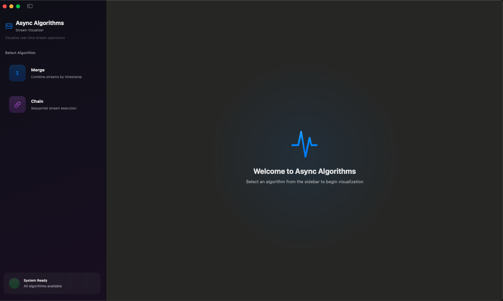
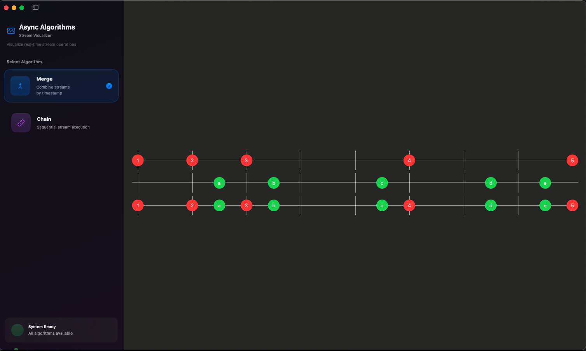
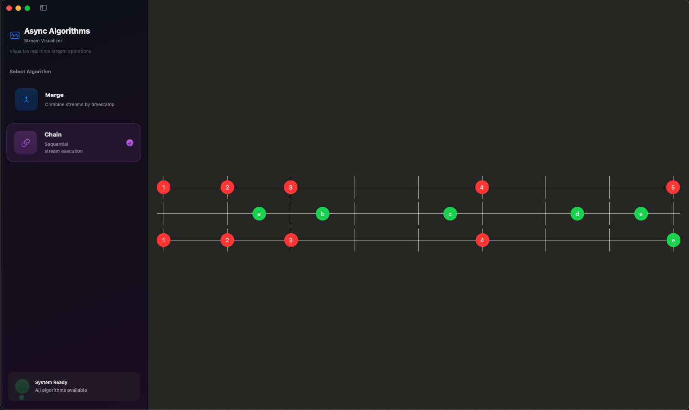
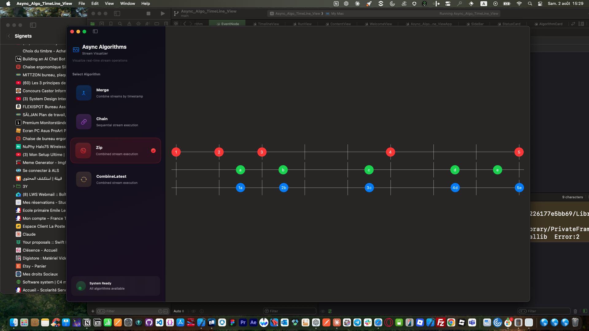
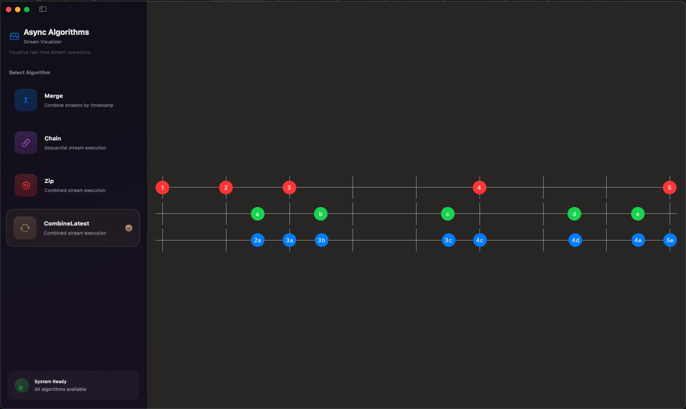

# Async Algorithms Timeline View

<div>

[](https://swift.org)
[](https://developer.apple.com)
[](https://github.com/apple/swift-testing)
[](LICENSE)

</div>

## 🎯 Overview

Async Algorithms Timeline View is a **modern SwiftUI application** that provides interactive visualization of Swift's async stream algorithms. Experience **real-time stream operations** through an elegant, drag-and-drop interface that makes complex concurrent programming concepts accessible and fun to learn.

## ✨ Features

### 🔀 **Merge Algorithm**
- **Time-based merging** of multiple async streams
- **Preserves original timestamps** for authentic visualization
- **Interactive timeline** showing natural stream interleaving

### 🔗 **Chain Algorithm** 
- **Sequential execution** of async streams
- **Real-time timestamp recording** during operation
- **Visual demonstration** of stream concatenation

### 🤝 **Zip Algorithm**

- **Synchronous pairing** of events from both streams
- Waits for both streams to have events before emitting pairs
- Visual demonstration of coordinated data combining

### 🔄 **CombineLatest Algorithm**

- **Continuous combination** of most recent values from each stream
- Real-time updates whenever any stream emits a new event
- Visual demonstration of live state synchronization

### 🎨 **Modern Interface**
- **Dark theme** with beautiful gradients
- **Glassmorphism effects** with blur backgrounds
- **Smooth animations** and micro-interactions
- **Drag & drop** event manipulation
- **Real-time updates** with instant feedback

### 🛠 **Technical Features**
- **Swift Concurrency** with async/await
- **AsyncStream & AsyncSequence** implementations
- **Custom Comparable Events** for proper sorting
- **Dynamic duration calculation** for flexible timelines
- **Hashable-based task triggering** for optimal performance

## 📱 Screenshots

<div align="center">
<table>
<tr>
<td></td>
<td></td>
<td></td>
<td></td>
<td></td>
</tr>
<tr>
<td align="center"><b>Welcome screen</b></td>   
<td align="center"><b>Merge Algorithm Visualization</b></td>
<td align="center"><b>Chain Algorithm Visualization</b></td>
<td align="center"><b>Zip Algorithm Visualization</b></td>
<td align="center"><b>CombineLatest Algorithm Visualization</b></td>
</tr>
</table>
</div>

## 🚀 Installation

### Requirements
- **iOS 16.0+** or **macOS 15.0+**
- **Xcode 16.0+**
- **Swift 6.0+**

### Clone & Run
```bash
git clone https://github.com/sassiwalid/Async_Algo_TimeLineView.git
cd Async_Algo_TimeLineView
open Async_Algo_Timeline_View.xcodeproj
```

### Swift Package Dependencies
```swift
dependencies: [
    .package(url: "https://github.com/apple/swift-async-algorithms", from: "1.0.4")
]
```

## 💡 Usage

### Basic Setup
```swift
import SwiftUI
import AsyncAlgorithms

@main
struct AsyncAlgoApp: App {
    var body: some Scene {
        WindowGroup {
            ContentView()
        }
    }
}
```

### Creating Custom Events
```swift
let customEvents = [
    Event(id: 0, time: 0.0, color: .blue, value: .int(42)),
    Event(id: 1, time: 1.5, color: .green, value: .string("hello")),
    Event(id: 2, time: 3.0, color: .red, value: .int(99))
]
```

### Running Algorithms
```swift
// Merge two streams by timestamp
let mergedResult = await run(algorithm: .merge, stream1Events, stream2Events)

// Chain streams sequentially  
let chainedResult = await run(algorithm: .chain, stream1Events, stream2Events)
```

## 🏗 Architecture

### Core Components
- **`Event`**: Comparable, Hashable data structure for timeline events
- **`Algorithm`**: Enum defining available stream operations
- **`TimelineView`**: Interactive timeline with drag & drop functionality
- **`EventNode`**: Draggable event visualization component
- **`RunView`**: Main visualization orchestrator

### Key Technologies
- **AsyncStream** for event stream generation
- **@GestureState** for smooth drag interactions
- **Task.sleep()** with speed factors for realistic timing
- **GeometryReader** for responsive timeline layouts
- **@State** and **@Binding** for reactive updates

## 🎓 Educational Value

Perfect for:
- **Learning Swift Concurrency** concepts
- **Understanding async streams** behavior
- **Visualizing concurrent algorithms** 
- **Teaching reactive programming** principles
- **Prototyping stream processing** ideas

## 🤝 Contributing

We welcome contributions! Please follow these steps:

1. **Fork** the repository
2. **Create** a feature branch (`git checkout -b amazing-feature`)
3. **Commit** your changes (`git commit -m 'Add amazing feature'`)
4. **Push** to the branch (`git push origin amazing-feature`)
5. **Open** a Pull Request

### Development Guidelines
- Follow **Swift API Design Guidelines**
- Write **comprehensive tests** for new features
- Update **documentation** for API changes
- Ensure **SwiftUI previews** work correctly

## 🐛 Known Issues

- [ ] Timeline zoom functionality not yet implemented
- [ ] Export to video feature in development
- [ ] More algorithm types coming soon

See [open issues](https://github.com/sassiwalid/Async_Algo_TimeLineView/issues) for a full list.

## 📄 License

This project is licensed under the **MIT License** - see the [LICENSE](LICENSE) file for details.

## 🙏 Acknowledgments

- **Apple** for Swift Concurrency and SwiftUI
- **objc.io** for inspiration on algorithm visualization
- **Swift Community** for async algorithms implementations
- **Contributors** who helped improve this project

---

<div align="center">

**Made with ❤️ and SwiftUI**

[⭐ Star this repo](https://github.com/sassiwalid/Async_Algo_TimeLineView) • [🐛 Report Bug](https://github.com/sassiwalid/Async_Algo_TimeLineView/issues) • [💡 Request Feature](https://github.com/sassiwalid/Async_Algo_TimeLineView/issues)

</div>
